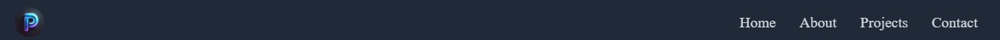
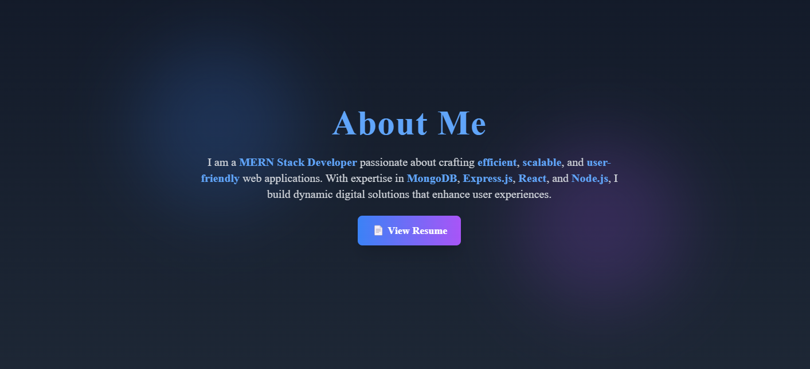
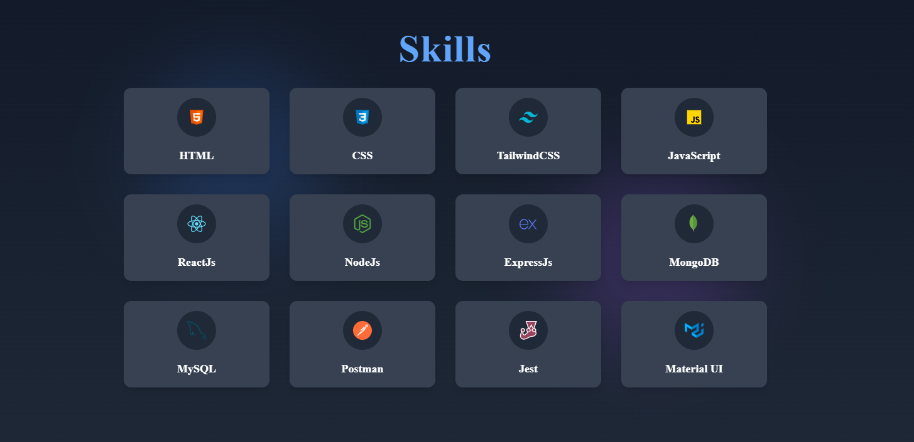
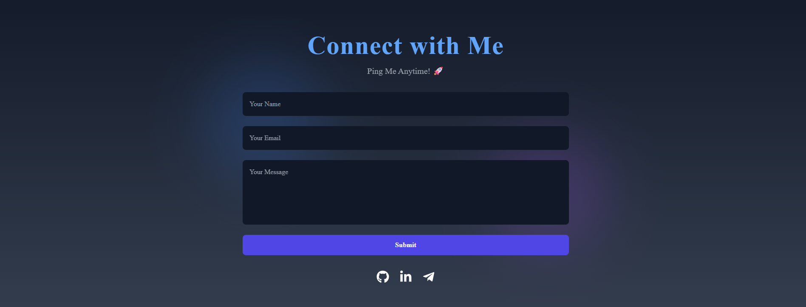

# 🗂️ Table of Contents

- [🗂️ Table of Contents](#️-table-of-contents)
- [📌 Portfolio](#-portfolio)
- [🌍 Live Demo](#-live-demo)
  - [✨ Features](#-features)
  - [📸 Screenshots](#-screenshots)
  - [⚙️ Tech Stack](#️-tech-stack)
  - [📂 Folder Structure](#-folder-structure)
    - [🧰 Installation Steps](#-installation-steps)
    - [🔗 Connect with Me](#-connect-with-me)

## 📌 Portfolio

A **modern, responsive, and minimalistic** portfolio showcasing my **skills, projects, and expertise** in **React and TailwindCSS**. Built with **Vite**, it ensures fast performance and an elegant UI.

Engineered with a modern tech stack – **ReactJS**, **TailwindCSS**, and **Vite** – to ensure a seamless user experience.

## 🌍 Live Demo

Experience it in action: [Live Demo](https://pavithrj.github.io/portfolio)

## ✨ Features

- 📱 **Fully Responsive Design** – Ensures a seamless experience across all devices, from desktops to mobile phones.
- 🎨 **Smooth Animations** – Beautiful transitions and hover effects for an engaging user experience.
- 🖥️ **Project Showcase** – Displays all your featured projects with live demos and GitHub links.
- 📄 **Downloadable Resume** – Allows visitors to easily download your latest resume in PDF format.
- 🔗 **Social Media Links** – Quick access to LinkedIn, GitHub, and other social profiles.
- 💬 **Interactive Contact Form** – Lets users send messages directly via a beautiful, validated contact form.

## 📸 Screenshots

| 🧭 Navbar |
|-|
|  |

| 🏠 Home |
|-|
|  |

| 👤 About |
|-|
|  |

| 🛠️ Skills |
|-|
|  |

| 📂 Projects |
|-|
|  |

| 📞 Contact |
|-|
|  |

## ⚙️ Tech Stack


## 📂 Folder Structure

```
Portfolio/
├── src/
│   ├── assets/
│   │   ├── about/
│   │   │   └── resume.pdf
│   │   ├── demo/
│   │   │   ├── about.png
│   │   │   ├── home.png
│   │   │   ├── navbar.png
│   │   │   └── skills.png
│   │   ├── home/
│   │   │   └── hero-pic.png
│   │   ├── navbar/
│   │   │   └── pj-logo.png
│   │   ├── Projects/
│   │   │   ├── imageOne.png
│   │   │   ├── imageTwo.png
│   │   │   ├── index.js
│   │   │   └── live-calendar.png
│   ├── components/
│   │   ├── icons/
│   │   │   ├── contact/
│   │   │   │   ├── GithubIcon.jsx
│   │   │   │   ├── LinkedInIcon.jsx
│   │   │   │   └── TelegramIcon.jsx
│   │   │   ├── navbar/
│   │   │   │   ├── CloseIcon.jsx
│   │   │   │   └── HamburgerIcon.jsx
│   │   │   ├── skills/
│   │   │   │   ├── CSSIcon.jsx
│   │   │   │   ├── ExpressJsIcon.jsx
│   │   │   │   ├── HTMLIcon.jsx
│   │   │   │   ├── JavaScriptIcon.jsx
│   │   │   │   ├── JestIcon.jsx
│   │   │   │   ├── MaterialUIIcon.jsx
│   │   │   │   ├── MongoDBIcon.jsx
│   │   │   │   ├── MySQLIcon.jsx
│   │   │   │   ├── NodeJsIcon.jsx
│   │   │   │   ├── PostmanIcon.jsx
│   │   │   │   ├── ReactJsIcon.jsx
│   │   │   │   └── TailwindCSSIcon.jsx
│   │   │   └── index.js
│   │   ├── layout/
│   │   │   ├── Footer.jsx
│   │   │   └── Navbar.jsx
│   │   ├── sections/
│   │   │   ├── About.jsx
│   │   │   ├── Contact.jsx
│   │   │   ├── Home.jsx
│   │   │   ├── Projects.jsx
│   │   │   ├── ScrollRestoration.jsx
│   │   │   └── Skills.jsx
│   ├── data/
│   │   ├── projects/
│   │   │   └── ProjectsData.jsx
│   ├── pages/
│   │   ├── AllProjects.jsx
│   │   └── Portfolio.jsx
│   ├── App.jsx
│   ├── index.css
│   └── main.jsx
├── .gitignore
├── eslint.config.js
├── index.html
├── package-lock.json
├── package.json
├── postcss.config.js
├── README.md
├── tailwind.config.js
└── vite.config.js
```

### 🧰 Installation Steps

```bash
git clone https://github.com/Pavithrj/portfolio.git
cd portfolio
npm install
npm run dev
```

### 🔗 Connect with Me

[](https://linkedin.com/in/pavithr-jain)
[](https://github.com/Pavithrj)
[](mailto:pavithrjain19@example.com)